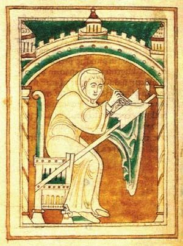

<table>
    <tr>
        <td>
            
        </td>
        <td>
            <h2>Hey, I'm Dustin 👋</h2>
            

                I'm currently learning IT at <a href="https://istts.ac.id/" target="_blank">iSTTS</a>.
            

            

                Currently working on a small project in C++. You can see it in the pinned repositories.
            

            <h2>What I Use</h2>
            
            
            
            
            
            

            
        </td>
    </tr>
</table>
